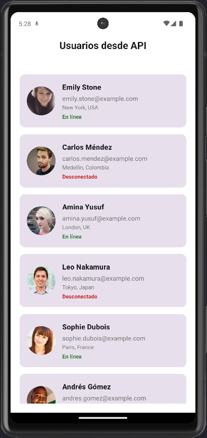

# 📱 Lista de Usuarios desde API - React Native + Expo

Una app hecha con React Native y Expo que consume la API pública de [Devs API Hub](https://devsapihub.com/docs/api-users) para mostrar una lista de usuarios.

## 📸 Vista previa



## 🚀 Tecnologías usadas

- React Native
- Expo
- React Native Paper
- Fetch API

## 🔧 Funcionalidades

- Llama a `https://devsapihub.com/api-users` al iniciar la app.
- Muestra una lista de tarjetas (Cards) con nombre, correo, ubicación, estado de conexión e imagen del usuario.
- Indicador de carga mientras se obtiene la información.
- Diseño responsive usando Flexbox y React Native Paper.

## 📁 Estructura del proyecto

```
/assets
  /css
    home.js        # Archivo de estilos

App.js             # Lógica principal del proyecto
```

## ▶️ Cómo ejecutar

1. Clona el repositorio o copia los archivos:
```bash
git clone https://github.com/tu-usuario/usuarios-api-app.git
cd usuarios-api-app
```

2. Instala las dependencias:
```bash
npm install
```

3. Corre la app con Expo:
```bash
npx expo start
```


## 🙌 Cómo puedes apoyar 📢:

✨ **Comparte este proyecto** con otros desarrolladores para que puedan beneficiarse 📢.

☕ **Invítame un café o una cerveza 🍺**:
   - [Paypal](https://www.paypal.me/iamdeveloper86) (`iamdeveloper86@gmail.com`).

### ⚡ ¡No olvides SUSCRIBIRTE a la [Comunidad WebDeveloper](https://www.youtube.com/WebDeveloperUrianViera?sub_confirmation=1)!


#### ⭐ **Déjanos una estrella en GitHub**:
   - Dicen que trae buena suerte 🍀.
**Gracias por tu apoyo 🤓.**